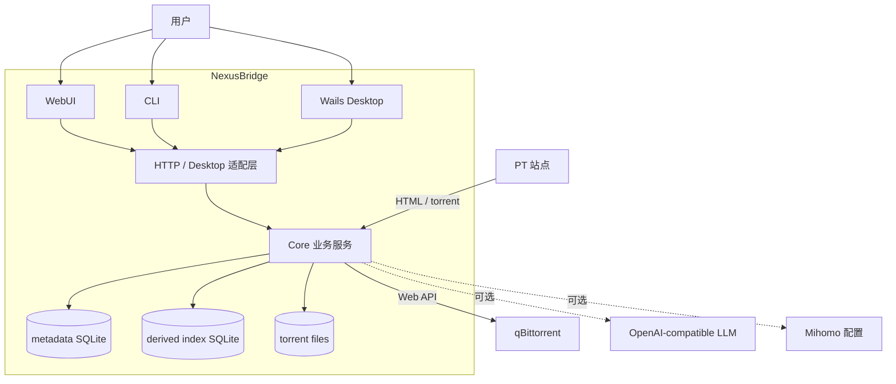
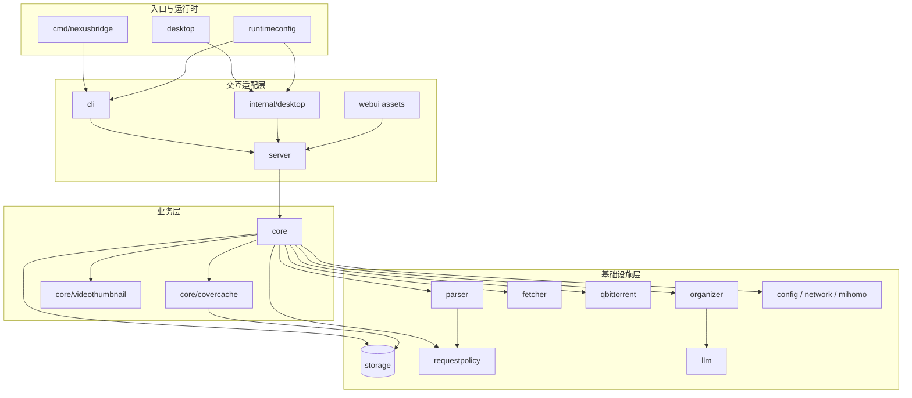
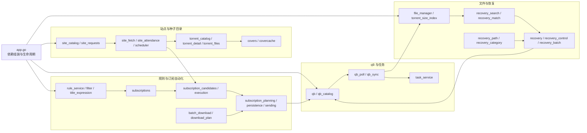
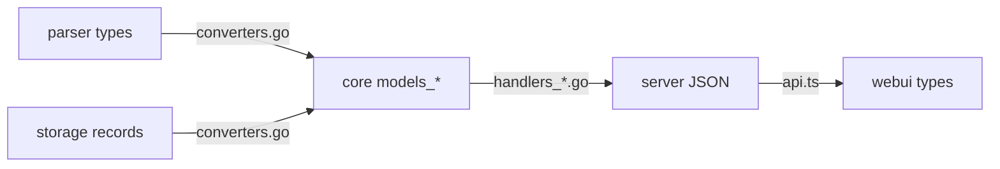
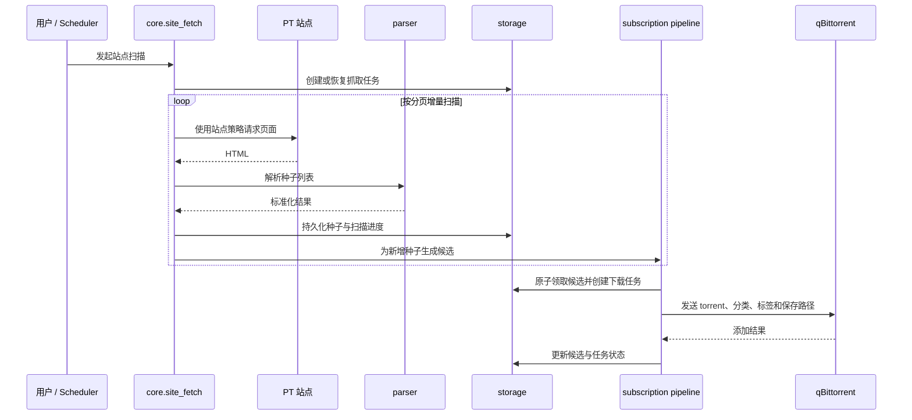
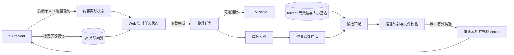
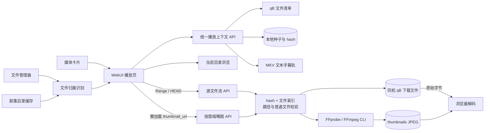
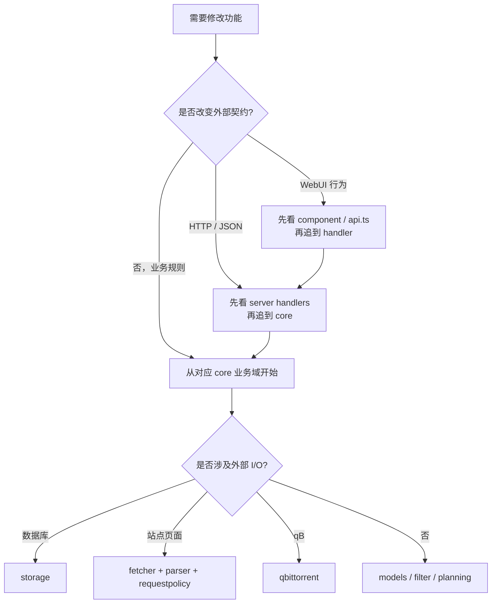

# 架构与代码导航

本文从系统边界逐层下钻到后端分层、核心业务域和关键运行流程，最后给出代码入口。业务细节继续查看[站点抓取](modules/site.md)、[订阅](modules/subscriptions.md)、[媒体筛选](modules/media-filtering.md)、[本地剧集](modules/series.md)、[媒体播放](modules/playback.md)、[媒体缩略图](modules/video-thumbnails.md)和[任务恢复](modules/recovery.md)；前端 URL、HTTP API、运行配置、存储设计和测试边界分别见 [WebUI 路由](frontend.md)、[API](api.md)、[配置](config.md)、[存储与数据库](storage.md)和[测试](testing.md)。

## 1. 系统全景

NexusBridge 通过同一套 `core` 服务支持 Web、CLI 和桌面端。外部系统只经基础设施适配器接入；业务元数据、派生索引和 torrent 原文件分层保存。

图中实线是主要运行路径，虚线是可选能力。LLM 目前仍是 demo 能力，不进入核心抓取、订阅和恢复链路。

## 2. 后端分层与依赖方向

后端遵循“入口与适配 → 业务编排 → 基础设施”的单向依赖。`core` 决定业务流程，各适配层只负责协议转换和生命周期管理。

依赖约束：

- `server`、`cli` 和 `desktop` 不复制业务流程，只调用 `core`。
- `core` 可以组合多个基础设施包，基础设施包不得反向依赖 `core`。
- `parser` 只解析定义和 HTML，不直接访问网络、数据库或 UI。
- `storage` 负责持久化语义，不负责调度、下载和页面解析。
- `stringutil`、`urlutil` 是无业务状态的叶子工具包，可被各层复用。

## 3. Core 业务域

`core` 保持单包以共享事务编排和领域模型，但文件按四个业务域组织。`app.go` 只负责组装共享依赖和生命周期。

领域之间通过明确的业务动作连接，而不是共享隐式全局状态：站点扫描产生种子和订阅候选，订阅流水线产生下载任务，qB 同步更新任务状态，恢复域利用本地种子元数据重新挂载文件。

站点每日签到与周期扫描共用常驻调度器、站点锁和统一 Cookie 请求入口，但使用独立的 `site_attendance_schedules` 配置与状态，不触发解析、订阅或 qB 流程。

### 领域模型与转换

`models_site.go`、`models_torrent.go`、`models_subscription.go`、`models_qb_catalog.go`、`models_download.go`、`models_recovery.go` 和 `models_tasks.go` 按领域承载跨适配层模型；`converters.go` 集中处理 parser、storage 与 core 之间的转换。

## 4. 关键运行流程

### 4.1 站点扫描到 qB 下载

站点计划和订阅计划相互独立：站点计划负责按时抓取，即使当前没有启用订阅也会执行；订阅只消费扫描产生的候选。更细的分页、增量边界和配额规则见[站点抓取](modules/site.md)与[订阅](modules/subscriptions.md)。

### 4.2 qB 同步、整理与恢复

进度、状态、速度、流量、ETA 和 ratio 只存在于后端共享内存，使用时从 qB 刷新；SQLite 只保存 hash、分类、标签、保存路径等稳定关联。恢复链路使用单行完整大小多重集签名缩小候选，再读取内容寻址 torrent 文件做精确验证；不维护本地下载目录索引。具体安全边界见[任务恢复](modules/recovery.md)。

### 4.3 同机源文件播放

播放入口可来自数据库种子、文件管理器或本地剧集。剧集只保存名称、有序目录、扫描缓存和最后选集；保存、手动重扫和进入剧集播放页时才递归扫描，不运行目录 watcher 或定时任务。选中的文件仍先与实时 qB 文件清单精确匹配，再按 hash 补充数据库详情；因此数据库种子、qB-only 任务和普通本机文件共享一个播放上下文。qB 流和缩略图请求都会重新验证下载根目录与文件索引；普通文件沿用文件管理器的本机访问边界。视频只在浏览器请求 `thumbnail_url` 时以 FFprobe/FFmpeg CLI 生成并保存到数据库同级文件缓存，最多两路并发，不写数据库或失败状态；文件浏览器和 qB 选集中的图片直接复用各自受控原文件接口，不创建图片缓存。MKV 文本字幕轨按需导出为 WebVTT，音视频响应仍使用标准字节范围传输；两者都不转码、不调整下载优先级。剧集完整结构见[本地剧集](modules/series.md)，通用播放流程见[媒体播放](modules/playback.md)，缩略图缓存与部署边界见[媒体缩略图](modules/video-thumbnails.md)。

## 5. 代码导航

以下按“从入口找到业务，再从业务找到基础设施”的顺序列出主要路径。无需从文件表逐项阅读。

### 5.1 入口与适配

| 路径 | 定位 |
| --- | --- |
| `cmd/nexusbridge/main.go` | 服务版进程入口。 |
| `internal/cli/root.go` | Cobra 命令、参数和进程生命周期。 |
| `desktop/main.go` | Wails 窗口、托盘和单实例入口。 |
| `internal/desktop/runtime.go`、`internal/desktop/assets.go` | 桌面端共享 core/server 生命周期与前端 History 路由回退。 |
| `internal/server/server.go` | HTTP 服务组装和路由。 |
| `internal/server/handlers_*.go` | 按 session、torrent、series、logs、automation、recovery、settings、task 分组的 HTTP 适配。 |
| `internal/server/http_helpers.go` | JSON 响应、查询参数和静态 WebUI 服务。 |
| `internal/runtimeconfig/` | 数据目录、配置文件、内置站点和构建模式。 |

### 5.2 Core 业务入口

| 业务域 | 主要文件 |
| --- | --- |
| 应用组装 | `app.go`、`services.go`、`converters.go`、`helpers.go` |
| 站点、种子、剧集与播放 | `site_catalog.go`、`site_requests.go`、`site_attendance.go`、`site_fetch.go`、`scheduler.go`、`torrent_*.go`、`series.go`、`series_episode.go`、`playback.go`、`video_thumbnails.go`、`covers.go`、`cover_images.go` |
| 规则与订阅 | `rule_*.go`、`filter.go`、`title_expression.go`、`subscriptions.go`、`subscription_*.go` |
| 下载与 qB | `download_plan.go`、`batch_download.go`、`qb.go`、`qb_catalog.go`、`qb_poll.go`、`qb_sync.go` |
| 文件与恢复 | `file_manager.go`、`torrent_size_index.go`、`recovery*.go` |
| 任务与可选能力 | `task_service.go`、`mihomo.go`、`network.go` |
| 领域模型 | `models_site.go`、`models_torrent.go`、`models_series.go`、`models_playback.go`、`models_subscription.go`、`models_qb_catalog.go`、`models_download.go`、`models_recovery.go`、`models_tasks.go` |

### 5.3 基础设施包

| 包 | 职责与主要文件 |
| --- | --- |
| `internal/storage` | `sqlite.go` 管理 WAL、单写者和双数据库，`schema.go` 定义完整新库；其余文件按 torrent、剧集、搜索/恢复索引、rule、subscription、task、qB 稳定关联、credential 和 cover cache 分域持久化。 |
| `internal/parser` | `definitions.go` 加载站点定义，`parser.go` 提供解析入口，`search_form.go`、`torrent_rows.go`、`pagination.go` 分解页面解析。 |
| `internal/fetcher` | HTTP 请求、重定向和 curl 输入解析。 |
| `internal/requestpolicy` | 域名规则、Cookie 白名单和请求决策。 |
| `internal/qbittorrent` | qB 认证、torrent、文件、分类、标签、控制、同步和元数据 API。 |
| `internal/core/covercache` | 封面文件缓存、状态机和并发控制；持久状态仍由 storage 保存。 |
| `internal/core/videothumbnail` | FFprobe/FFmpeg 按需取帧、文件指纹、原子 JPEG 缓存和并发限制；不写 SQLite。 |
| `internal/logging` | 方括号结构化日志、当前进程最近日志环形缓冲区和实时订阅；不读取历史日志文件。 |
| `internal/llm`、`internal/organizer` | OpenAI-compatible 客户端和媒体整理建议校验；当前为可选 demo 链路。 |
| `internal/config`、`internal/network`、`internal/mihomo` | 配置校验、代理环境和 Mihomo Provider 管理。 |
| `internal/stringutil`、`internal/urlutil` | 无状态、无业务依赖的共用工具。 |

### 5.4 WebUI、构建与部署

| 区域 | 主要路径 |
| --- | --- |
| WebUI 入口 | `webui/src/main.ts`、`router.ts`、`App.vue`、`api.ts`、`types.ts` |
| 业务界面 | `webui/src/components/MediaView.vue`、`SeriesView.vue`、`FilePickerDialog.vue`、`ResizableModal.vue`、`PlaybackView.vue`、`components/player/`、`SubscriptionsView.vue`、`FileManagerView.vue`、`LogsView.vue`、`TasksView.vue`、`Settings*.vue` |
| 前端状态与工具 | `webui/src/composables/`、`webui/src/utils/`、`webui/src/config/` |
| 前端行为文档 | `docs/frontend.md`、`docs/modules/media-filtering.md`、`docs/modules/playback.md` |
| WebUI 构建 | `webui/package.json`、`vite.config.ts`、`pnpm-lock.yaml` |
| 桌面构建 | `Taskfile.yml`、`desktop/tasks/`、`desktop/resources/` |
| 发布流水线 | `.github/workflows/build-release.yml`、`publish-release.yml`、`build-docker.yml` |
| 容器部署 | `docker/Dockerfile`、`docker/root/`、`docker/compose.yaml` |
| CI 脚本 | `scripts/ci/` |

## 6. 修改时如何定位

完成实现后，仅在外部契约变化时同步 API 文档，在运行行为或配置变化时同步配置文档；业务流程细节写入对应的 `docs/modules/` 文档，本文只维护稳定的依赖关系和代码导航。
