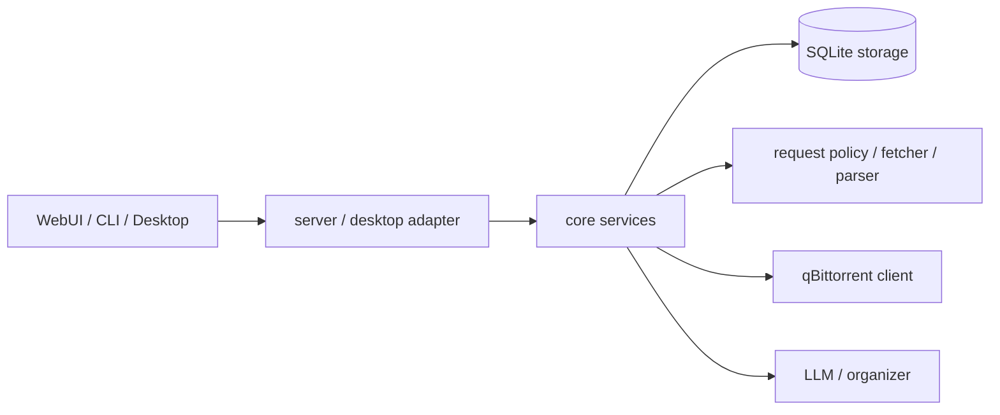

# 架构与文件导航

本文只说明源码职责和模块依赖。业务流程按需查看[站点](modules/site.md)、[订阅](modules/subscriptions.md)和[任务恢复](modules/recovery.md)。API、配置和测试分别见 `api.md`、`config.md`、`testing.md`。

依赖只朝图中箭头方向扩展：适配层不复制 core 业务流程，parser 不依赖网络、数据库或 UI。

## 入口、运行与构建

| 文件 | 职责 |
| --- | --- |
| `cmd/nexusbridge/main.go` | WebUI/CLI 服务版进程入口。 |
| `internal/cli/root.go` | Cobra 命令、参数和进程生命周期。 |
| `internal/server/server.go` | HTTP 路由、JSON 适配和静态 WebUI 服务。 |
| `desktop/main.go` | Wails 窗口、托盘和单实例入口。 |
| `desktop/assets.go` | 嵌入桌面图标资源。 |
| `internal/desktop/runtime.go` | 共享 core/server 生命周期与 Wails HTTP 中间件。 |
| `internal/runtimeconfig/runtime.go` | 数据目录、配置文件和内置站点准备。 |
| `internal/runtimeconfig/mode_development.go` | 开发构建模式标记。 |
| `internal/runtimeconfig/mode_production.go` | 正式构建模式标记。 |
| `webui/assets_development.go` | 开发时读取本地 dist 或返回提示页。 |
| `webui/assets_production.go` | 正式构建时嵌入 WebUI dist。 |
| `go.mod`、`go.sum` | Go 模块声明和依赖锁定。 |
| `Taskfile.yml` | WebUI/CLI 与桌面构建任务入口。 |
| `desktop/tasks/common.yml` | Wails 共用前端构建任务。 |
| `desktop/tasks/linux.yml` | Linux 桌面构建与打包任务。 |
| `desktop/tasks/windows.yml` | Windows 桌面构建与打包任务。 |
| `desktop/resources/wails.yml` | Wails 应用元数据和开发配置。 |
| `desktop/resources/windows/info.json` | Windows 可执行文件版本资源。 |
| `desktop/resources/windows/wails.exe.manifest` | Windows 可执行文件 manifest。 |
| `desktop/resources/windows/nsis/project.nsi` | NSIS 安装器入口。 |
| `desktop/resources/windows/nsis/wails_tools.nsh` | NSIS 共用辅助函数。 |
| `desktop/resources/appicon.png`、`windows/icon.ico` | 桌面应用图标。 |
| `.github/workflows/build-release.yml` | 多平台构建编排。 |
| `.github/workflows/publish-release.yml` | 构建产物发布为 GitHub Release。 |
| `scripts/ci/build-release-linux.sh` | Linux 发布包构建脚本。 |
| `scripts/ci/build-release-windows.ps1` | Windows 发布包构建脚本。 |
| `scripts/ci/run-act.ps1` | Windows 本地 act 入口。 |
| `scripts/ci/act-runner.Dockerfile` | act 使用的 Linux ARM64 runner 镜像。 |

## Core 业务层

| 文件 | 职责 |
| --- | --- |
| `internal/core/app.go` | 组装共享应用服务、站点目录和通用业务入口。 |
| `internal/core/models.go` | 跨适配层使用的领域模型。 |
| `internal/core/services.go` | core 对外服务接口。 |
| `internal/core/memory.go` | 无持久化场景使用的内存目录实现。 |
| `internal/core/filter.go` | 筛选规则匹配、排序和拒绝原因。 |
| `internal/core/title_expression.go` | 标题布尔表达式解析与匹配。 |
| `internal/core/rule_options.go` | 从本地数据生成规则可选项。 |
| `internal/core/download_plan.go` | 渲染 qB 保存路径、分类、标签和名称计划。 |
| `internal/core/subscriptions.go` | 规则、订阅、候选和站点计划的管理与预览。 |
| `internal/core/subscription_execution.go` | 执行订阅候选领取、配额判断和发送。 |
| `internal/core/batch_download.go` | 手动批量下载的预览与执行。 |
| `internal/core/scheduler.go` | 站点计划调度、防重入和取消。 |
| `internal/core/torrent_files.go` | 下载、解析并持久化 torrent 文件。 |
| `internal/core/site_requests.go` | 统一站点凭据、Cookie 策略和 HTTP 请求入口。 |
| `internal/core/covers.go` | 受站点凭据保护的封面代理。 |
| `internal/core/qb.go` | qB 配置、客户端缓存、发送和兼容状态查询。 |
| `internal/core/qb_catalog.go` | qB 分类与标签缓存管理。 |
| `internal/core/qb_sync.go` | qB 全量同步与完成任务处理。 |
| `internal/core/qb_poll.go` | qB 增量同步并更新本地快照。 |
| `internal/core/file_manager.go` | 文件浏览、qB 归属标记和恢复候选扫描。 |
| `internal/core/recovery.go` | 恢复匹配、qB 路径映射、校验和启动。 |
| `internal/core/recovery_batch.go` | 串行执行唯一恢复候选。 |
| `internal/core/torrent_size_index.go` | 恢复用文件大小索引状态与重建。 |

## 基础设施

| 文件 | 职责 |
| --- | --- |
| `internal/config/config.go` | JSON 配置结构、默认值和校验。 |
| `internal/logging/logging.go` | 终端与文件日志初始化。 |
| `internal/builtin/assets.go` | 嵌入内置站点定义。 |
| `internal/builtin/sites/kamept.json` | 内置 KamePT 站点定义。 |
| `internal/builtin/sites/common/nexusphp_search.json` | 内置 NexusPHP 搜索表单解析规则。 |
| `internal/requestpolicy/policy.go` | 域名规则和 Cookie 白名单决策。 |
| `internal/fetcher/fetcher.go` | HTTP 请求、重定向和 curl 输入解析。 |
| `internal/parser/definitions.go` | 站点定义加载与规范化。 |
| `internal/parser/parser.go` | 搜索表单、列表页和详情页 HTML 解析。 |
| `internal/parser/types.go` | 站点定义与解析结果类型。 |
| `internal/qbittorrent/client.go` | qB 连接、认证和基础 HTTP 请求。 |
| `internal/qbittorrent/torrents.go` | torrent、分类、标签和文件重命名 API。 |
| `internal/qbittorrent/sync.go` | qB `sync/maindata` 协议。 |
| `internal/qbittorrent/transfer.go` | torrent 元数据、hash 和添加结果校验。 |
| `internal/storage/sqlite.go` | SQLite 连接、迁移、WAL 和连接池。 |
| `internal/storage/mvp.go` | 种子、规则、下载任务、整理任务和通用设置。 |
| `internal/storage/subscriptions.go` | 订阅、候选、运行记录和站点计划。 |
| `internal/storage/torrent_files.go` | torrent BLOB、hash 和文件大小索引。 |
| `internal/storage/qb_snapshots.go` | qB 任务状态快照。 |
| `internal/storage/qb_config.go` | qB 分类、标签及同步状态缓存。 |
| `internal/storage/cookies.go` | 站点作用域 Cookie。 |
| `internal/storage/credentials.go` | 站点凭据元数据与 Cookie 状态。 |
| `internal/llm/client.go` | OpenAI-compatible Chat Completions 客户端。 |
| `internal/organizer/organizer.go` | 校验整理建议并创建媒体硬链接。 |

## WebUI

| 文件 | 职责 |
| --- | --- |
| `webui/src/main.ts` | Vue 应用启动。 |
| `webui/src/App.vue` | 应用壳、导航、共享状态和全局操作。 |
| `webui/src/api.ts` | 后端 HTTP 调用统一入口。 |
| `webui/src/types.ts` | 前端共享 API 和领域类型。 |
| `webui/src/style.css` | 全局布局和主题样式。 |
| `webui/src/env.d.ts` | Vite 与 Vue 类型声明。 |
| `webui/src/components/MediaView.vue` | 媒体列表、筛选和 qB 状态展示。 |
| `webui/src/components/MediaQuickSettings.vue` | 媒体布局快捷设置。 |
| `webui/src/components/TorrentStatusControl.vue` | 单任务下载、暂停和恢复控件。 |
| `webui/src/components/FileManagerView.vue` | 文件浏览、恢复预览和批量恢复。 |
| `webui/src/components/SubscriptionsView.vue` | 规则、订阅、计划和批量下载工作区。 |
| `webui/src/components/TasksView.vue` | 下载与整理任务列表。 |
| `webui/src/components/SettingsSites.vue` | 站点凭据和抓取操作。 |
| `webui/src/components/SettingsQB.vue` | qB 连接与轮询设置。 |
| `webui/src/components/SettingsLLM.vue` | LLM 连接设置。 |
| `webui/src/composables/useMediaDisplaySettings.ts` | 本地持久化媒体显示偏好。 |
| `webui/src/composables/useQBStatusPolling.ts` | 按连接和页面状态轮询 qB。 |
| `webui/src/config/qbittorrent.ts` | qB 前端默认配置。 |
| `webui/src/utils/format.ts` | 字节大小和速度格式化。 |
| `webui/src/utils/runtime.ts` | 浏览器与 Wails 运行时差异。 |
| `webui/index.html` | Vite HTML 入口。 |
| `webui/package.json` | 前端依赖和命令。 |
| `webui/pnpm-lock.yaml`、`pnpm-workspace.yaml` | pnpm 依赖锁与工作区定义。 |
| `webui/tsconfig.json` | TypeScript 编译配置。 |
| `webui/vite.config.ts` | Vite 开发服务和构建配置。 |
| `webui/playwright.config.ts` | WebUI 端到端测试运行配置。 |
