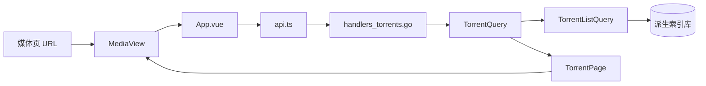
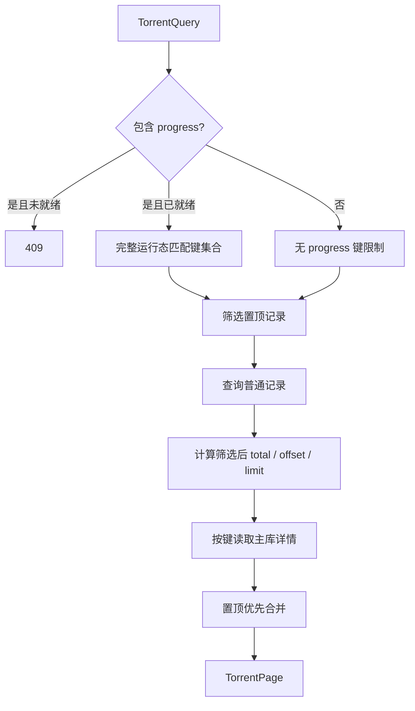

# 媒体筛选

媒体筛选由 WebUI、HTTP API、core 查询编排和派生索引共同完成。所有条件必须在分页前应用，确保 `total`、页码、置顶记录和普通记录使用相同语义。

当前实现包含站点、站点分类、促销状态、关键词、置顶开关和 qB 状态。tag 筛选尚未实现。新增条件时应继续扩展统一查询模型，不在 `MediaView` 中过滤当前页。

## 查询契约

媒体页使用 `TorrentPageQuery` / `TorrentQuery` / `TorrentListQuery` 逐层传递查询条件：



`GET /api/torrents` 的站点字段参数为：

| 参数 | 取值 | 含义 |
| --- | --- | --- |
| `category` | 可重复的分类显示值 | 同类值按 OR 匹配 |
| `site_checkbox` | 可重复的 `group:value` | 同一 checkbox 分组内按 OR 匹配 |
| `promotion` | 可重复的 `spstate.filter_value` | 同类值按 OR 匹配 |

这些参数只能与单个 `site_id` 一起使用，不同 checkbox 分组、分类与促销之间按 AND 匹配。值由 `GET /api/sites/{site_id}/media-filter-options` 提供；`cat` checkbox 作为分类，其余 checkbox 保留站点分组，促销读取 `role=promotion` 的 `spstate` 定义并排除 `all`。非法站点、分组、值或缺少 `site_id` 返回 `400 Bad Request`。

qB 参数为：

| 参数 | 取值 | 含义 |
| --- | --- | --- |
| `qb_task` | `present` | 只返回已关联 qB 任务的种子 |
| `qb_task` | `absent` | 只返回未关联 qB 任务的种子 |
| `qb_progress` | `complete` | 只返回 `progress >= 1` 的 qB 任务 |
| `qb_progress` | `incomplete` | 只返回 `progress < 1` 的 qB 任务 |

`qb_progress` 仅允许与 `qb_task=present` 同时使用。非法枚举或组合返回 `400 Bad Request`。首次成功同步完整 qB 运行态前，progress 条件返回 `409 Conflict`。响应继续使用统一的 `TorrentPage`，不增加筛选专用响应结构。

省略两个 qB 参数表示不筛选。WebUI 中“未选择任何复选项”对应这一默认状态。

## qB 状态的数据来源

qB 状态拆成稳定关联和实时运行态：

- `torrent_qb_associations` 位于可重建派生索引库，保存任务是否存在、hash 等稳定关联，用于 `present` / `absent`。
- `App.qbRuntime` 保存本进程最近一次完整 qB 运行态，用于 progress 边界判断和当前卡片状态。
- `qbRuntimeReady` 表示当前配置是否至少完成过一次成功的完整同步。

筛选请求只消费这些已有状态，不主动访问 qB。首次成功后若 qB 断线，后端保留本进程最后一次运行态，WebUI 显示旧状态提示；进程重启后仍需重新完成一次运行态同步，不能把稳定关联快照当作完整 progress 数据。

保存 qB 配置会重置前后端就绪标记。自动同步可用时会立即发起第一次轮询，不先等待一个周期；显式全量同步成功也会标记运行态可用，即使自动轮询关闭。

## 后端分页流程

`core.ListTorrentPage` 先取得 progress 匹配键集合，再分别处理置顶和普通记录：



普通记录在派生索引库中连接 `torrent_search` 与 `torrent_qb_associations`：

- 站点、分类、checkbox 站点标签、促销、关键词和 qB 任务存在性在同一个有序查询中完成。
- 非分类 checkbox 分组使用派生索引中的 `tag_ids_json`；同组内任一标签命中即可，不同组分别应用 `EXISTS` 条件。
- 促销使用稳定的 `promotion_class` 首个 class 匹配；空 class 对应 `normal`。
- progress 使用 core 生成的完整键集合，在遍历有序候选键时判断成员关系。
- 排除置顶键、计算 `total`、跳过 `offset` 和收集 `limit` 的顺序固定，不对当前页做二次过滤。
- progress 键集合留在内存，不拼接超大的 SQL `IN (...)` 参数列表。
- 取得页面键后才从主库批量读取完整种子记录。

置顶记录来自 core 的置顶快照，但应用与普通记录相同的站点、分类、checkbox、促销、关键词、任务存在性和 progress 条件。筛选后仍按置顶等级优先，普通记录按发布时间和稳定键排序；总数等于筛选后的置顶数与普通数之和。

## WebUI 状态与交互

媒体页 URL 使用与 API 对应的参数：

```text
/media?site=kamept&category=同人AV&site_checkbox=source:全身无码&promotion=pro_free&qb_task=present&qb_progress=incomplete
```

刷新或直接打开 URL 会恢复筛选。无效组合会被规范化并移除；任一筛选变化都会回到第一页。默认状态不写入筛选参数。

站点字段按钮只在选择单个站点后启用。切换站点会清除原站点条件；选择“全部站点”时按钮禁用。较宽的复选下拉框按站点 checkbox 分组和促销分区、多列展示，选择后不自动关闭；未选择表示不限制，顶部重置按钮清空全部站点字段条件。各分组的已选数量会显示在分区和按钮摘要中。

qB 筛选按钮带固定 `qB` 标识和当前摘要。弹层使用树状复选视觉：

```text
未添加
已添加
  已完成
  未完成

未选择时显示全部                 重置筛选
```

交互状态会归一化为五种后端可表达的条件：

| UI 状态 | `qb_task` | `qb_progress` |
| --- | --- | --- |
| 未选择 / 重置 | 省略 | 省略 |
| 未添加 | `absent` | 省略 |
| 已添加，两个子项全选 | `present` | 省略 |
| 只选已完成 | `present` | `complete` |
| 只选未完成 | `present` | `incomplete` |

只选择一个 progress 子项时，“已添加”显示半选状态。选择不会立即关闭弹层。当前 API 是单一谓词，不支持“未添加或已完成”一类跨分支组合；UI 不应产生后端无法准确分页的组合。

首次运行态未就绪时，WebUI 保留用户选择和 URL 中的 `qb_progress`，但请求暂时只提交 `qb_task=present`，提示当前展示全部已添加任务。就绪标记变化后自动重新读取页面并应用 progress 条件。

## 刷新与并发控制

前端为每个种子维护 `absent`、`complete`、`incomplete` 分类快照。qB 增量轮询更新卡片实时字段时，仅在以下情况重新请求筛选页：

- 任务在已添加和未添加之间变化。
- progress 跨过 `1` 的完成边界。
- 首次运行态变为就绪，需要应用此前暂缓的 progress 条件。

速度、ETA、ratio 或未跨界的普通进度变化只更新卡片，不重复读取分页。

分页请求使用递增序号；旧请求即使后返回也不能覆盖新筛选结果。同步事件触发的重复重载通过微任务合并。筛选后总数收缩导致当前页越界时，`MediaView` 回到最后一个有效页并同步 URL。

## 扩展新筛选项

新增 tag 或标题/简介搜索时按以下顺序修改：

1. 在 `webui/src/types.ts`、core `TorrentQuery` 和 storage `TorrentListQuery` 增加独立字段。
2. 在 `api.ts` 与 `handlers_torrents.go` 定义参数编码、枚举和组合校验。
3. 从站点定义生成选项时提供稳定的查询值和用户可读标签，不让 WebUI 推断站点字段。
4. 在派生索引查询中应用条件，保证条件先于 `total/offset/limit`。
5. 让置顶记录复用完全相同的匹配规则。
6. 在 `MediaView` 中维护 URL 规范化、默认值移除和页码重置，不过滤 `props.torrents`。
7. 判断后台状态变化是否真的改变当前筛选成员，再决定是否重读页面。
8. 同步更新 `docs/api.md`、OpenAPI、`docs/frontend.md` 和本文。

关键词当前覆盖标题、分类、促销和站点，并按现有 FTS/短文本查询路径执行。若未来将“标题/简介搜索”定义为新的用户契约，应先明确索引字段和兼容语义，不直接扩大现有 `q` 的匹配范围。

## 代码导航

| 层 | 主要入口 |
| --- | --- |
| WebUI 查询与复选菜单 | `webui/src/components/MediaView.vue` |
| 分页请求、分类快照与重载 | `webui/src/App.vue` |
| qB 轮询生命周期 | `webui/src/composables/useQBStatusPolling.ts` |
| 前端 API 与类型 | `webui/src/api.ts`、`webui/src/types.ts` |
| 站点字段选项 | `internal/core/site_catalog.go`、`internal/server/handlers_session.go` |
| HTTP 参数校验 | `internal/server/handlers_torrents.go` |
| core 分页与置顶合并 | `internal/core/torrent_catalog.go`、`internal/core/models_torrent.go` |
| 派生索引查询 | `internal/storage/torrent_search.go`、`internal/storage/torrents.go` |
| qB 稳定关联 | `internal/storage/qb_snapshots.go` |
| 索引表与索引项 | `internal/storage/schema.go` |
