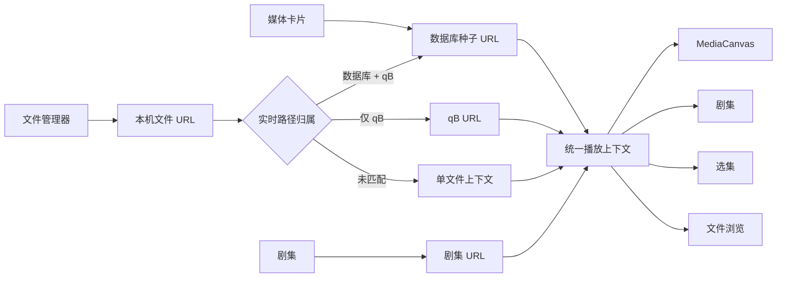

# 媒体播放

播放页统一处理数据库种子、qB 任务、本机文件和本地剧集。NexusBridge 只读取同机源文件并使用 HTTP Range 传给浏览器，不转码、不解码、不调整 qB 文件优先级。

## 入口与规范 URL

| 来源 | 页面 URL | 清单 API |
| --- | --- | --- |
| 本地剧集 | `/play/series/:series_id?path=<绝对路径>` | `GET /api/series/{series_id}/playback?path=...` |
| 数据库种子 | `/play/:site_id/:torrent_id?file=<qB 相对文件名>` | `GET /api/torrents/{site_id}/{torrent_id}/playback?file=...` |
| 仅 qB 任务 | `/play/qb/:hash?file=<qB 相对文件名>` | `GET /api/playback/qb/{hash}?file=...` |
| 本机文件 | `/play/file?path=<绝对路径>` | `GET /api/playback/file?path=...` |

媒体卡片从数据库种子入口打开。文件管理器对识别出的图片、视频和音频提供播放按钮、双击和右键播放，并从本机文件入口打开新标签页。剧集页从本地剧集入口打开，保留剧集规范 URL，同时复用相同的文件归属识别。

文件入口按以下顺序识别归属：

1. 将文件规范化为本机绝对路径。
2. 遍历实时 qB 任务及其文件清单，对解析后的文件路径做精确匹配。
3. 匹配 qB 后，再用 hash 查找本地数据库种子。
4. 匹配数据库时规范化为数据库种子 URL；只匹配 qB 时规范化为 qB URL。
5. 都未匹配时保留本机文件 URL，只显示播放器和文件浏览。

当前播放文件始终写入 URL。选集切换使用 qB 相对文件名，目录文件切换先进入文件 URL，再由后端重新识别并规范化，因此刷新和直接打开都能恢复同一文件。

## 统一播放上下文

`PlaybackContext` 的主要模块为：

- `source`：`torrent`、`qb` 或 `file`。
- `torrent`：可选数据库详情；qB-only 和本机单文件可以没有。
- `qb_status`、`qb_hash`：可选 qB 归属。
- `files`：qB 媒体选集；单文件上下文只有当前文件。
- `current_file_index`、`default_file_index`：当前和默认媒体。
- `current_path`、`current_directory`：当前本机文件及目录。
- `directory_files`：清单生成时的目录快照；前端文件标签后续使用文件浏览 API 导航。
- `series`、`series_files`：仅剧集入口存在，分别提供剧集摘要和按目录顺序排列的视频缓存。

qB 选集展示固定扩展名白名单识别出的图片、视频和音频。文件进度大于零且同机文件可读取时允许尝试播放；零进度禁用。默认文件依次选择完整视频、完整音频、完整图片，没有完整文件时选择进度最高的可用文件。

## 页面模块

播放页使用连续区块布局，不使用悬浮卡片画布：

- 左侧上方是稳定比例的媒体画布，下方是当前标题、状态和可选数据库简介。
- 播放上下文带 `qb_hash` 时显示“删除 qB 任务”；确认框要求选择保留文件或同时删除文件，成功后停止继续读取已经失效的播放清单。
- 右侧上方是一个带“剧集 / 选集 / 文件”标签的媒体浏览区块。
- “剧集”只在剧集入口显示并作为默认标签；暂时不可用的视频保留在清单中但不可点击。
- “选集”只在存在 qB 上下文时显示。
- “文件”使用 `POST /api/files/browse` 读取当前目录；完整路径限制在窗格宽度内并以省略号截断，悬停可查看原值。
- 文件列表采用类似 Windows 文件资源管理器的紧凑行布局，没有卡片边框或明显的文件间分界；`..` 导航父目录，文件夹只负责继续浏览，不显示播放按钮。
- 从文件窗格切换媒体时保留当前标签和浏览目录。旧播放器、简介和侧栏会持续显示到新上下文返回，只在播放器内显示局部切换状态，避免整页加载闪烁。
- 右侧下方是其他含完整音视频的数据库种子；纯本机文件不显示。
- 窄屏按媒体画布、简介、媒体浏览、其他种子的顺序纵向排列。

页面路由和播放器按需加载。`MediaCanvas` 根据 `media_type` 分派播放器，切换文件时卸载旧播放器：

| 类型 | 默认播放器 | 可选配置 |
| --- | --- | --- |
| 视频 | Artplayer | `artplayer`、`native` |
| 音频 | Vidstack 原生 audio provider | `vidstack`、`native` |
| 图片 | 原生查看器 | `native` |

配置位于 `webui/src/config/mediaPlayer.ts`。WAV 通过正确 MIME 和带扩展名的流地址交给浏览器原生音频解码。图片查看器初始等比例适应画布，支持缩放、拖动、重置和全屏。

### MKV 内嵌字幕

播放清单只对当前 MKV 文件读取容器头部，列出可转换的内嵌文本字幕轨。支持 `S_TEXT/UTF8`、`S_TEXT/WEBVTT`、`S_TEXT/ASS` 和 `S_TEXT/SSA`；PGS、VobSub 等图片字幕不做 OCR 或转换。

字幕接口按播放来源重新解析受控源文件和轨道 ID，将文本轨导出为 WebVTT。单条响应最大 32 MiB，不生成持久字幕文件，也不读取或转换音视频轨。Artplayer 默认选择 forced 轨、default 轨或第一条文本轨，并在设置面板提供多字幕切换和时间偏移；原生视频播放器使用标准 `<track>` 元素。

## 源文件传输与边界

| 上下文 | 源文件 API |
| --- | --- |
| 数据库种子 | `GET\|HEAD /api/torrents/{site_id}/{torrent_id}/media/{file_index}` |
| qB 任务 | `GET\|HEAD /api/playback/qb/{hash}/media/{file_index}` |
| 本机文件 | `GET\|HEAD /api/playback/file/media?path=...` |

字幕 URL 由当前媒体的 `subtitles[].stream_url` 提供，三类来源分别使用数据库种子、qB hash 或绝对文件路径重新定位同一个 MKV。

qB 接口每次都按 hash 和文件索引重新读取实时清单，不信任客户端提交的相对路径。qB 文件先拒绝绝对相对名、`.`、`..` 和字面越界，再解析符号链接并确认最终普通文件仍在实际 `save_path` 内；目录内的符号链接可直接使用。

本机文件接口接受绝对路径，与文件管理器具有相同的本机文件访问边界。路径会出现在页面 URL 和播放上下文中，不应公开分享含敏感目录名的地址。

所有源文件使用 `http.ServeContent` 返回，支持 Range、seek、HEAD、`Content-Length` 和 `Last-Modified`。浏览器不支持的容器或编码只显示播放错误，不提供转换回退。

## 剧集扫描与选择

剧集保存名称、有序目录、扫描缓存、最近扫描时间和最后选集。创建、编辑、手动重扫和进入剧集播放页会执行递归扫描；列表查询不会扫描，也没有后台 watcher 或周期轮询。扫描仅保留现有视频白名单中的普通文件，不跟随目录符号链接；同一剧集拒绝重复或嵌套重叠目录，不同剧集可以引用相同目录。

每个可读目录独立替换缓存。目录暂时不可读时保留原缓存、记录错误并把其中视频标为不可用；目录恢复后再次扫描即可恢复。成功扫描确认删除的视频会从缓存移除。播放选择优先使用 URL 中仍可用的路径，其次使用最后选集，最后使用自然排序后的第一项；暂时离线的最后选集不会被覆盖。

剧集的数据结构、管理 UI、API、扫描状态机和代码入口集中见[本地剧集](series.md)。

## 代码导航

| 职责 | 代码 |
| --- | --- |
| 上下文、归属识别、目录和流文件解析 | `internal/core/playback.go` |
| 剧集 CRUD、扫描和选择 | `internal/core/series.go` |
| 播放领域模型 | `internal/core/models_playback.go` |
| HTTP 路由与响应 | `internal/server/server.go`、`internal/server/handlers_torrents.go` |
| 页面路由和状态 | `webui/src/router.ts`、`webui/src/components/PlaybackView.vue` |
| 文件管理器入口 | `webui/src/components/FileManagerView.vue` |
| 播放器分派和实现 | `webui/src/components/player/` |
| API | `docs/api.md`、`docs/api/openapi.yaml` |
