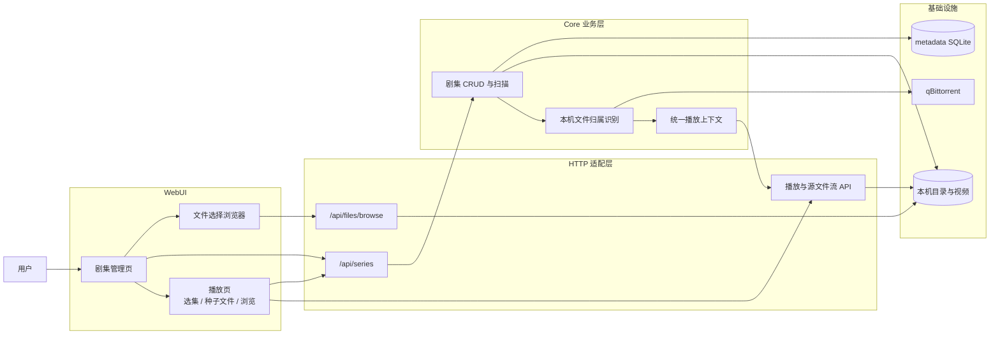
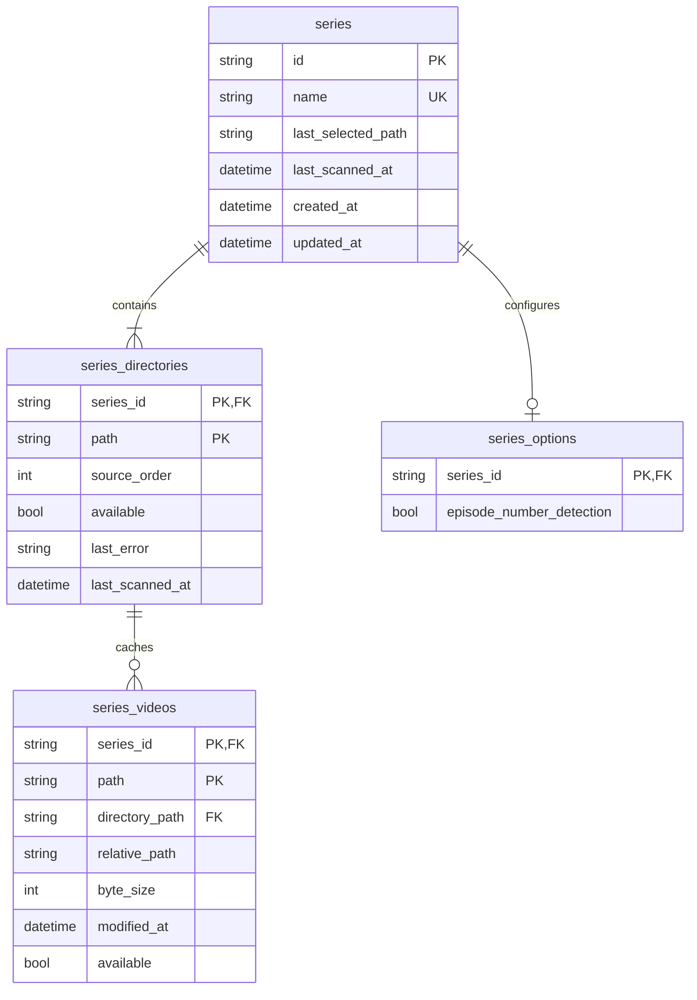
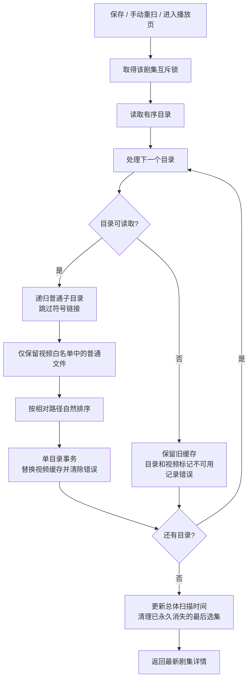
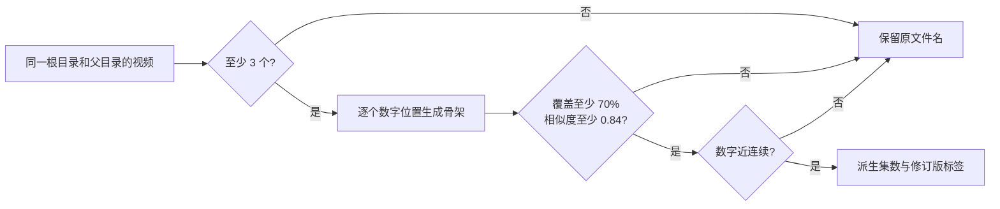
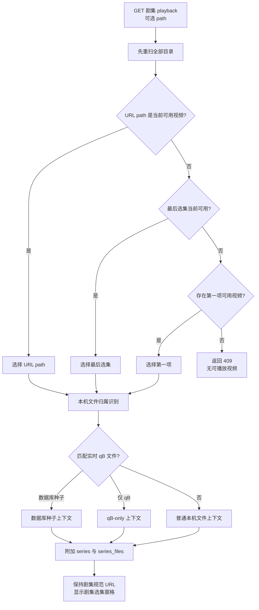

# 本地剧集

本地剧集把一部电视剧、动漫或其他系列关联到一个或多个本机目录，并把扫描到的视频组织为连续选集。它只管理目录配置、视频清单缓存和最后选集，不复制、移动或删除媒体文件。

## 功能边界

- 一个剧集包含唯一名称和若干个有顺序的本机绝对目录。
- 创建、编辑、手动重扫和进入剧集播放页时扫描；列表与详情查询只读缓存。
- 扫描只识别现有播放器白名单中的视频普通文件，不抓取影视元数据，不解析季号或集号。
- 不运行文件系统 watcher、后台轮询、转码或远程路径映射。
- 删除剧集只删除 SQLite 配置和缓存，绝不修改源目录与视频。
- 最后选集只记录文件路径，不记录播放时间点。

## 结构

剧集路由保持 `/play/series/:series_id?path=...`，不会因为选中的文件属于 qB 或数据库种子而改写为其他播放路由。所选文件仍复用现有本机文件归属识别，因此可以获得数据库种子详情、qB 种子文件、Range、字幕和原文件解码能力。

## 数据模型

| 数据 | 语义 |
| --- | --- |
| `series` | 剧集身份、大小写不敏感唯一名称、最后选集和总体扫描时间 |
| `series_options` | 每个剧集独立的集数识别开关；旧剧集没有记录时按关闭处理 |
| `series_directories` | 有序扫描根目录，以及各目录独立的可用状态、错误和扫描时间 |
| `series_videos` | 可重建的视频清单缓存，保存根目录归属、相对路径、大小、修改时间和可用状态 |

剧集 ID 由后端随机生成。移除目录或删除剧集时，SQLite 外键只级联清理对应选项和缓存。不同剧集可以引用同一个目录。识别得到的集数和版本不写入 SQLite，而是在读取视频缓存时派生。

## 创建与编辑

保存前执行以下校验：

1. 名称去除首尾空白后不能为空，并且不能与其他剧集名称大小写不敏感地重复。
2. 至少提供一个目录；每个目录都必须是当前可解析、可读取的绝对目录。
3. 根目录会解析为规范路径。同一剧集内拒绝重复目录，以及父子嵌套的重叠目录。
4. 目录数组顺序写入 `source_order`，后续决定选集分组顺序。
5. `episode_number_detection` 保存为该剧集的独立开关；关闭时不运行文件名识别。

保存配置后立即扫描。编辑时移除的目录会同时移除该目录的旧视频缓存，但不会触碰磁盘文件。

WebUI 的目录行有两种状态：

- 展示态完整显示路径并允许换行；“浏览”只读查看当前目录，不会替换表单值。
- 双击路径进入编辑态后，可直接输入或通过“选择”替换目录；完成后恢复展示态。

新增/编辑和文件选择弹窗可以拖动右边缘调整宽度，并在浏览器 `localStorage` 中分别记忆宽度。文件选择器还会记住上次使用的目录；调用方提供起始目录时优先使用指定值。文件选择弹窗高度固定，条目数量只影响内部滚动。

## 扫描流程

同一剧集的保存、删除、扫描和最后选集写入共用进程内互斥锁；不同剧集可以并行操作。互斥范围只覆盖当前进程，不是跨进程分布式锁。

结果排序先按目录添加顺序分组，再按各目录内的相对路径自然排序。因此 `Episode 2` 会排在 `Episode 10` 前面。开启集数识别时只补充显示标签，不改变缓存内容或上述文件顺序。

### 集数识别

集数识别是剧集级手动开关，使用保守的组内判断：

1. 输入只来自 `series_videos`，即扫描白名单确认的视频；图片、字幕、音频和其他文件不会进入分母。
2. 视频按扫描根目录和相对父目录分组，至少需要 3 个视频，不跨季目录或不同根目录比较。
3. 对每个文件名数字位置分别尝试候选，把该数字替换为统一占位后比较文件名骨架；文件名中的 `v2` 等版本数字先被屏蔽，避免误认成集数。
4. 候选聚类至少覆盖组内 70% 的视频，骨架相似度至少为 0.84，并要求数字大体连续、相邻差值主要位于 1 到 3。
5. 识别成功的视频返回 `episode_number` 和 `episode_label`；紧跟集数的 `v2` 会额外返回 `episode_version=2`，标签显示为“第 06 集 · v2”。未进入高置信聚类的视频保持无标签。

### 可读与离线目录

- 可读目录按单目录事务完整替换缓存。确认已经删除的文件会从缓存消失。
- 某个目录暂时不可读时，其他目录继续扫描；该目录旧缓存保留，但目录和其中视频标记为不可用并记录错误。
- 离线目录恢复后，再次保存、重扫或进入播放页即可恢复其清单。
- 最后选集仍存在于离线缓存时不会被清除；只有它从所有缓存永久消失时才清除。

## 播放与选集

进入播放页只按上述优先级选择当前视频，不会擅自覆盖最后选集。用户在右侧“选集”标签主动切换视频时，前端先调用 selection API 保存选择，再更新 `path` 路由。暂时不可用的视频保留在清单中展示，但不能点击。

识别成功时，选集卡片把集数作为主标识。前端先按 `[]` 和 `【】` 切分文件名，再排除组内多数视频共有的片段、集数本身和常见技术参数，只把有区分度的剩余片段作为短标题；卡片副信息只显示体积，完整文件名保留在悬停提示中。没有集数标签时继续显示原文件名，不执行激进裁剪。qB 上下文和目录浏览分别使用“种子文件”“浏览”标签，避免与剧集选集混淆。

统一 `PlaybackContext` 保留原有 `source`、`files`、qB 状态、目录文件和字幕结构，并额外提供：

- `series`：当前剧集摘要。
- `series_files`：按目录顺序和自然顺序排列的完整视频缓存。

源文件仍由现有播放接口读取。qB 文件继续按 hash 和文件索引校验；普通本机文件沿用文件管理器的访问边界。可用剧集视频包含按需 `thumbnail_url`，右侧选集窗格懒加载 JPEG，失败时保留视频图标；清单和扫描本身不运行 FFmpeg。浏览器不支持的容器或编码不会转码回退。

## HTTP API

| 接口 | 行为 | 是否扫描 |
| --- | --- | --- |
| `GET /api/series` | 返回全部缓存摘要 | 否 |
| `POST /api/series` | 创建剧集、保存识别开关并返回详情 | 是 |
| `GET /api/series/{id}` | 返回缓存详情和视频清单 | 否 |
| `PUT /api/series/{id}` | 更新名称、目录和识别开关 | 是 |
| `DELETE /api/series/{id}` | 删除配置和缓存 | 否 |
| `POST /api/series/{id}/scan` | 手动重扫 | 是 |
| `POST /api/series/{id}/selection` | 校验并保存可用视频路径 | 否 |
| `GET /api/series/{id}/playback?path=...` | 重扫并返回增强播放上下文 | 是 |

请求与响应字段的完整定义以 [HTTP API](../api.md) 和 [OpenAPI](../api/openapi.yaml) 为准。无效名称、目录或选集返回 `400`；剧集或文件不存在返回 `404`；没有可播放视频返回 `409`；底层播放源暂时不可用返回 `503`。

## 页面与状态

| 页面或状态 | 行为 |
| --- | --- |
| `/series` | 展示缓存摘要、目录状态、可用/总视频数、扫描时间和错误；支持新增、编辑、删除、重扫 |
| `/play/series/:series_id?path=...` | 进入时重扫，默认打开右侧“选集”标签并保持规范剧集 URL |
| URL `path` | 当前播放视频的绝对路径，刷新后可恢复；可能暴露本机目录结构 |
| SQLite `last_selected_path` | 跨刷新、重启和客户端共享的最后选集业务状态 |
| `localStorage` | 文件选择器上次目录和弹窗宽度等当前浏览器 UI 偏好 |

零可用视频的剧集仍保留在管理页并显示目录错误，但播放入口禁用。

## 安全与副作用

- 扫描只读文件系统元数据，不修改目录内容。
- 删除和编辑只变更数据库配置与缓存，不删除、移动或重命名源文件。
- 剧集扫描不会访问 PT 站点，也不会改变 qB 下载优先级。
- 播放 URL 和 API 响应可能包含绝对路径，不应公开分享含敏感目录名的地址。
- 构建与离线检查只能证明接口和页面静态正确；真实目录权限、浏览器解码、Range seek 和字幕仍需用实际媒体人工确认。

## 代码导航

| 职责 | 代码 |
| --- | --- |
| 领域模型 | `internal/core/models_series.go` |
| 校验、锁、扫描、排序和播放选择 | `internal/core/series.go` |
| 高相似视频文件名与集数识别 | `internal/core/series_episode.go` |
| SQLite 配置与缓存 | `internal/storage/series.go`、`internal/storage/schema.go` |
| HTTP handler 与路由 | `internal/server/handlers_series.go`、`internal/server/server.go` |
| 统一文件播放与归属识别 | `internal/core/playback.go` |
| 前端类型和请求 | `webui/src/types.ts`、`webui/src/api.ts` |
| 管理页面 | `webui/src/components/SeriesView.vue` |
| 文件选择与可调弹窗 | `webui/src/components/FilePickerDialog.vue`、`webui/src/components/ResizableModal.vue` |
| 播放页面与选集窗格 | `webui/src/components/PlaybackView.vue` |
| 媒体缩略图组件 | `webui/src/components/MediaThumbnail.vue` |
| 页面路由与导航 | `webui/src/router.ts`、`webui/src/App.vue` |
