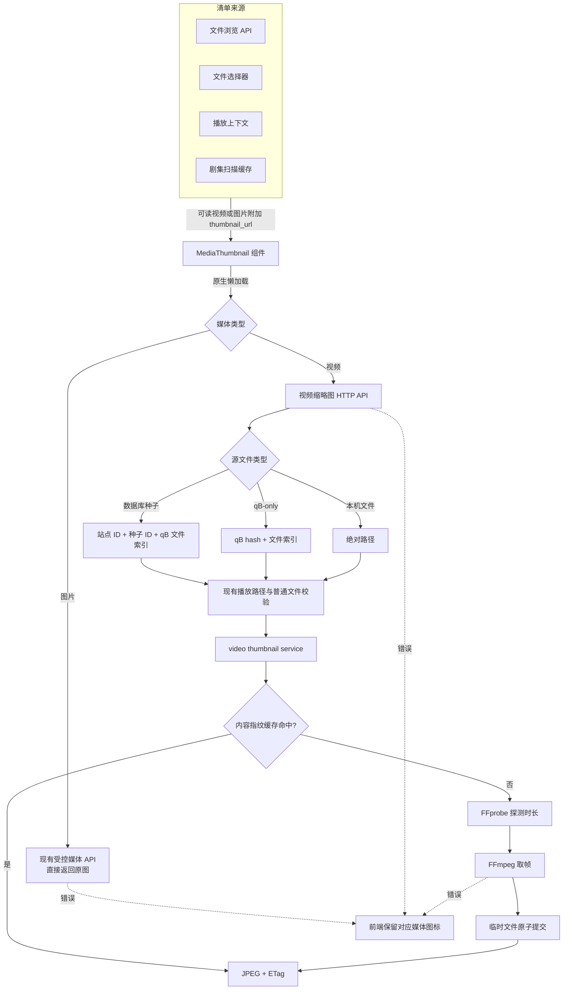
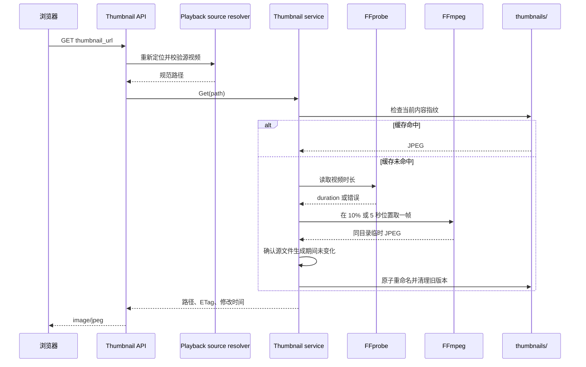

# 媒体缩略图

媒体缩略图模块为本机可读视频生成单张 JPEG 列表预览，并在文件浏览器中直接懒加载原图片。两类媒体都复用现有文件和 qB 播放边界；只有视频在浏览器真正请求时调用 FFprobe/FFmpeg，图片不生成或存储独立缩略图。

## 功能边界

- 视频展示范围包括主文件浏览页、文件选择器，以及播放器右侧“选集 / 种子文件 / 浏览”列表。
- 图片展示范围包括主文件浏览页、文件选择器和播放器右侧“种子文件 / 浏览”列表。
- 目录、音频、普通文件和不可用媒体继续显示原图标。
- 每个视频只生成一张静态 JPEG，不生成时间轴、雪碧图、动画预览或媒体库封面。
- 不运行后台预生成、定时刷新、文件系统 watcher 或全局缓存回收任务。
- 图片预览或视频缩略图失败不影响目录浏览、剧集扫描或源文件播放。
- 当前实现调用 FFprobe/FFmpeg CLI，不进行播放转码，也不通过 libav C API 解码。

## 整体结构



清单模型中的 `thumbnail_url` 只是显示入口。视频 URL 不代表缓存已经存在，图片 URL 则直接定位现有原文件接口；这样大量目录和剧集可以快速返回，网络读取和 FFmpeg 工作量由浏览器可见区域及原生懒加载控制。

## 清单字段与前端行为

以下模型使用可选 `thumbnail_url`：

| 模型 | 使用位置 |
| --- | --- |
| `FileEntry` | 主文件页、文件选择器、播放器“浏览”标签；视频和图片均可存在 |
| `PlaybackMedia` | 播放器“种子文件”标签；视频和图片均可存在 |
| `PlaybackDirectoryFile` | 播放上下文中的当前目录快照；视频和图片均可存在 |
| `SeriesVideo` | 播放器“选集”标签 |

后端只有在条目满足以下条件时才返回 URL：

1. 文件扩展名属于现有播放器视频或图片白名单。
2. 文件当前存在并且是普通文件。
3. 当前进程可以打开文件读取。
4. qB 视频或图片来源的文件具有已下载数据，并通过保存目录边界校验。
5. 剧集来源的视频当前标记为可用。

`MediaThumbnail.vue` 使用固定尺寸占位，内部图片设置 `loading="lazy"` 和 `decoding="async"`。原图请求使用较高 `fetchpriority`，并取消图片淡入动画；内容成功加载后立即覆盖图片图标。HTTP 错误、损坏响应或生成失败时只隐藏图片，行高、点击区域和播放操作保持不变。没有缩略图的条目仍预留同宽首列并把图标居中，使文件名与缩略图条目对齐；主文件页还会把普通图标放大到接近缩略图高度，避免两类条目出现明显的视觉尺寸落差。

## HTTP 接口

图片不新增专用接口。文件浏览器的 `thumbnail_url` 直接使用：

`GET /api/playback/file/media?path=...`

qB 种子文件图片则直接复用对应 `PlaybackMedia.stream_url`，即数据库种子或 qB-only 的既有媒体流接口。这些接口返回原图片内容，并复用文件索引或本机路径校验、MIME、条件请求和 Range 语义。服务端不缩放、不转码、不写入 `thumbnails/`；大图片仍可能传输完整原文件，因此前端保留懒加载，只提高已触发请求的优先级。

视频使用以下按需生成接口：

| 来源 | 接口 |
| --- | --- |
| 数据库种子 | `GET /api/torrents/{site_id}/{torrent_id}/media/{file_index}/thumbnail` |
| qB 任务 | `GET /api/playback/qb/{hash}/media/{file_index}/thumbnail` |
| 本机文件 | `GET /api/playback/file/thumbnail?path=...` |

三类接口不信任 `thumbnail_url` 中的源文件信息：

- 数据库种子入口重新解析种子与实时 qB 任务，再按文件索引定位源文件。
- qB 入口重新按 hash 获取任务和文件清单，再校验文件索引。
- 本机入口重新解析绝对路径、符号链接、普通文件属性和媒体白名单。
- qB 文件解析后必须仍位于任务实际保存目录内。

成功响应：

| 响应项 | 值 |
| --- | --- |
| `Content-Type` | `image/jpeg` |
| `ETag` | 当前源文件内容指纹 |
| `Cache-Control` | `private, no-cache` |
| `X-Content-Type-Options` | `nosniff` |
| 响应方式 | `http.ServeContent`，支持条件请求 |

错误响应不是图片，并设置 `Cache-Control: no-store`。典型状态包括：

| 状态 | 场景 |
| --- | --- |
| `400` | 本机文件入口缺少 `path` |
| `404` | 文件、索引不存在，或目标不是视频 |
| `409` | qB 任务未关联，或文件尚无下载数据 |
| `503` | 源文件暂时不可读、FFmpeg 缺失、超时或生成失败 |

## 缓存指纹与布局

以下缓存只用于视频；图片原图预览不会在服务端创建文件。视频缓存位于元数据库同级目录，不写入 SQLite：

```text
<metadata-dir>/
└── thumbnails/
    └── <规范源路径 SHA256 前两位>/
        └── <规范源路径 SHA256>/
            └── <内容指纹>.jpg
```

内容指纹由以下值共同计算：

- 规范化后的源文件路径；
- 文件大小；
- 文件修改时间；
- 缩略图生成版本。

源文件大小、修改时间或生成规则变化时会得到新的缓存文件名。新版本成功提交后，模块清理同一规范源路径目录中的旧 JPEG；生成失败时不删除先前文件，但旧指纹不会被当作当前版本返回。

已删除视频遗留的缓存不做后台 GC。管理员可以在应用停止后删除整个 `thumbnails/` 目录，后续视频缩略图请求会按需重建；该操作不会影响数据库、剧集配置或媒体源文件。

## 生成流程



生成参数保持稳定：

- FFprobe 成功时截取视频时长的 `10%` 位置。
- FFprobe 缺失或探测失败时使用 `5` 秒位置。
- 选择第一个视频流，只输出一帧。
- 最大尺寸为 `320×180`，保持原比例，不拉伸或裁切。
- 输出 JPEG，探测和生成共享 `30` 秒总超时。
- 临时文件与最终文件位于同一目录，通过重命名原子提交。
- 生成完成后再次检查源文件大小和修改时间；生成期间发生变化时丢弃结果。

## 并发与失败语义

- 同一规范视频路径使用独立进程内互斥锁，重复请求串行处理并复用首次成功结果。
- 所有视频共享两个执行槽，FFprobe 和 FFmpeg 阶段合计最多两路并发。
- 互斥锁和并发限制只作用于当前 NexusBridge 进程，不提供跨进程协调。
- 不写失败状态或负缓存。没有当前成功缓存时，每个新的视频缩略图请求都会重新尝试。
- 客户端取消或请求超时会阻止后续外部进程启动，或终止正在运行的外部进程；已经进入同路径互斥等待的请求会在前一个请求结束后检查取消状态。临时文件由服务清理。
- FFmpeg 诊断会作为服务错误的有限摘要返回，不持久化到数据库。

## FFmpeg 与动态库

顶层配置：

```json
{
  "video_thumbnail": {
    "ffmpeg_path": ""
  }
}
```

工具解析顺序：

1. `ffmpeg_path` 留空时从进程 `PATH` 查找 `ffmpeg`。
2. 指定路径时使用该 FFmpeg 可执行文件。
3. FFprobe 优先查找 FFmpeg 同目录的 `ffprobe` 或 `ffprobe.exe`。
4. 同目录不存在时回退进程 `PATH`。

配置只在应用启动时读取，修改后需要重启。FFmpeg 或 FFprobe 缺失不会阻止应用启动；FFprobe 单独缺失仍可使用 5 秒回退位置，FFmpeg 缺失则缩略图请求失败。

一体化 Docker 镜像通过 Alpine 发行版包安装动态链接的 FFmpeg、FFprobe 和共享 `libavcodec`、`libavformat`、`libavutil`、`libswscale` 等运行库，不使用静态单文件二进制。当前模块仍以 CLI 为稳定边界；未来改用 C API 时需要同时调整构建阶段的头文件、CGO 和跨架构链接配置，HTTP 接口与缓存语义可以保持不变。

## 安全与运维边界

- 视频缩略图和图片原图 URL 只能读取现有播放服务已经允许定位的本机文件，不增加远程路径映射。
- 本机文件 URL 和错误信息可能包含绝对路径，不应公开分享含敏感目录名的地址。
- 模块不修改、移动、删除源视频或图片，也不调整 qB 文件优先级。
- 缓存目录只保存视频派生 JPEG，可以整体删除重建；图片不会写入该目录。
- 缩略图不是转码回退；浏览器仍直接解码原始媒体流。
- Docker 静态构建成功只能证明包和接口存在，不能证明所有编码都能正确取帧。

人工验收应覆盖 MP4/MKV、长短视频、首次生成、缓存命中、源文件变化、多视频并发、部分下载文件，以及 FFmpeg/FFprobe 缺失和损坏视频的图标回退；图片部分应覆盖常见格式、原图懒加载、损坏图片回退，并确认不会向 `thumbnails/` 写入图片缓存。

## 代码导航

| 职责 | 代码 |
| --- | --- |
| 配置模型和启动组装 | `internal/config/config.go`、`internal/core/app.go` |
| 缩略图领域入口 | `internal/core/video_thumbnails.go` |
| 指纹、锁、工具调用和文件缓存 | `internal/core/videothumbnail/service.go` |
| 播放和路径边界 | `internal/core/playback.go` |
| 清单模型 | `internal/core/models_playback.go`、`models_recovery.go`、`models_series.go` |
| HTTP 路由和响应 | `internal/server/server.go`、`handlers_torrents.go` |
| 前端固定占位和错误回退 | `webui/src/components/MediaThumbnail.vue` |
| 文件与播放列表接入 | `FileManagerView.vue`、`FilePickerDialog.vue`、`PlaybackView.vue` |
| 配置与容器模板 | `data/config.example.json`、`docker/Dockerfile`、`docker/root/defaults/nexusbridge/config.json` |
| API 定义 | `docs/api.md`、`docs/api/openapi.yaml` |
