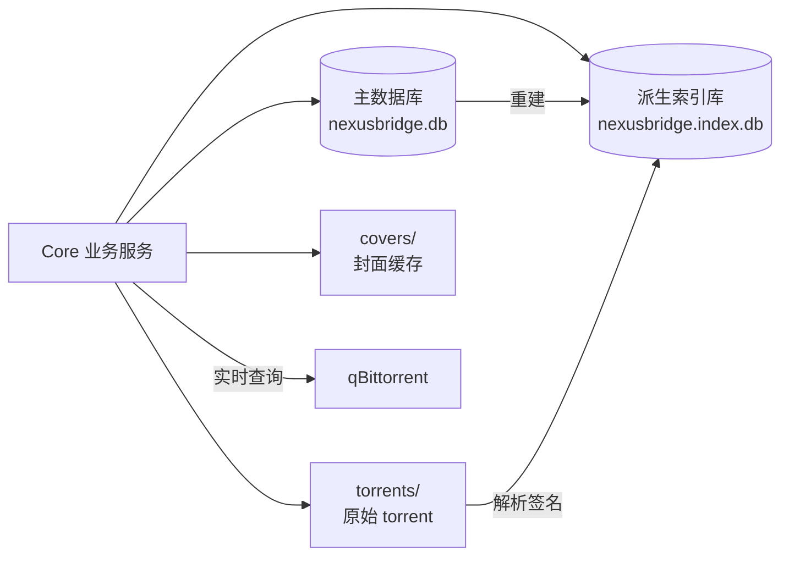
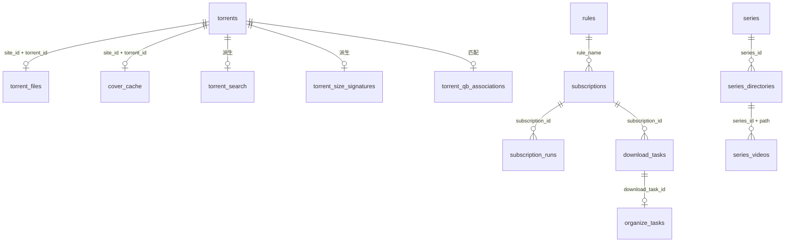

# 存储与数据库

本文说明 NexusBridge 当前持久化边界、SQLite 表结构、本地文件布局和维护策略。运行目录与配置覆盖顺序见[配置说明](config.md)，代码分层见[架构与代码导航](architecture.md)。

## 1. 存储边界

NexusBridge 保持单机本地存储，不依赖外部数据库服务。数据按用途拆为业务元数据库、可重建索引库和文件系统内容：



各类数据的恢复属性不同：

| 类型 | 内容 | 是否唯一数据 | 丢失后的处理 |
| --- | --- | --- | --- |
| 业务元数据 | 站点种子、规则、订阅、剧集、任务、凭据 | 是 | 从备份恢复或重新抓取 |
| 派生索引 | 搜索、大小签名、qB 稳定关联 | 否 | 从主库、torrent 文件和 qB 重建 |
| 内容文件 | 原始 `.torrent` | 是，站点仍可下载时可恢复 | 按需重新下载 |
| 缓存文件 | 封面图片 | 否 | 按需重新下载 |
| qB 实时状态 | 进度、速度、ETA、当前做种状态 | 否 | 使用时直接查询 qB |

## 2. 本地文件布局

开发构建默认使用仓库的 `data/`；正式构建默认使用系统用户配置目录中的 `NexusBridge`。`--config`、`NEXUSBRIDGE_DATA_DIR` 和旁置引导文件的优先级见[配置说明](config.md)。

默认布局：

```text
<data-root>/
├── config.json
├── nexusbridge.db
├── nexusbridge.db-wal
├── nexusbridge.db-shm
├── nexusbridge.index.db
├── nexusbridge.index.db-wal
├── nexusbridge.index.db-shm
├── nexusbridge.index.db.rebuilding
├── torrents/
│   └── <SHA256 前两位>/
│       └── <完整 SHA256>.torrent
├── covers/
│   └── <SHA256 前两位>/
│       └── <完整 SHA256>.img
├── logs/
│   └── nexusbridge.log
└── sites/
    └── html/
        └── **/*.json
```

`storage.path` 可以指向其他位置。派生索引库、`torrents/` 和 `covers/` 始终位于主数据库同级目录；日志和站点定义按各自配置解析。

- `.torrent` 以内容 SHA256 命名并分片存放，相同内容不会重复写入。
- `.img` 是封面响应体，真实 MIME 类型和校验信息记录在 `cover_cache`。
- `-wal` 和 `-shm` 是 SQLite WAL 模式的运行时附属文件，不是独立业务数据。
- `.rebuilding` 只在派生索引重建期间存在；启动时发现残留标记会丢弃未完成的索引并重新构建。
- `.torrent-*.tmp` 和 `.cover-*.tmp` 只在原子写入期间短暂存在。
- qB 的下载内容由 qB 管理；NexusBridge 只记录保存位置和内容路径。
- WebUI 布局等纯界面偏好保存在浏览器 `localStorage`，不进入服务端数据库；剧集最后选集属于跨客户端业务状态，保存在主库。

## 3. 数据库约定

主库和索引库都使用 SQLite。当前 schema 版本为 `1`，分别使用独立的 `application_id` 标识：

| 数据库 | 默认文件 | `application_id` | 用途 |
| --- | --- | --- | --- |
| 主数据库 | `nexusbridge.db` | `NXBR` | 业务事实和本地资源元数据 |
| 派生索引库 | `nexusbridge.index.db` | `NXBI` | 可重建的查询和恢复索引 |

字段约定：

- 时间通常使用 `TEXT`，业务时间由应用写为 UTC RFC3339，数据库时间戳使用 `CURRENT_TIMESTAMP`。
- 布尔值使用 `INTEGER` 的 `0/1`。
- 数组和小型结构使用 JSON 文本，例如 `tags_json`。
- 二进制内容不写入 SQLite。
- 多数业务表通过业务键建立逻辑关联；剧集目录和视频缓存使用带级联删除的 SQLite 外键，删除剧集仍只影响元数据。

## 4. 主数据库表

主数据库按站点资源、自动化、剧集和 qB 缓存等业务域分表保存。

### 4.1 站点、种子与本地资源

| 表 | 主键 | 主要内容 |
| --- | --- | --- |
| `cookies` | `(scope, name)` | Cookie 值、路径、域和更新时间 |
| `site_credentials` | `site_id` | 站点地址、User-Agent、自定义请求头 |
| `torrents` | `(site_id, torrent_id)` | 标题、分类、标签、促销、详情、体积、站点统计和抓取时间 |
| `torrent_files` | `(site_id, torrent_id)` | 文件相对路径、内容 SHA256、v1/v2 info hash、文件大小签名和索引状态 |
| `cover_cache` | `(site_id, torrent_id)` | 来源 URL、本地路径、MIME、SHA256、下载状态和失败信息 |

`torrents` 是站点业务元数据主表；`torrent_files` 和 `cover_cache` 是可选的一对一资源记录。三者分开是因为抓取统计、torrent 文件和封面重试具有不同的生命周期与写入频率，避免更新高频站点字段时改写低频文件字段。

### 4.2 设置、规则与订阅

| 表 | 主键 | 主要内容 |
| --- | --- | --- |
| `app_settings` | `key` | WebUI/API 保存的键值设置，包括 qB 密码和 API Key |
| `rules` | `name`，忽略大小写 | 站点、分类、标签、标题表达式、大小和统计筛选条件 |
| `subscriptions` | `id` | 规则引用、站点范围、优先级和 qB 下载计划 |
| `subscription_candidates` | `(site_id, torrent_id)` | 已匹配候选、处理状态和原因 |
| `subscription_ingest_queue` | `(site_id, torrent_id)` | 等待订阅匹配的新种子 |
| `subscription_runs` | `id` | 每次订阅运行的计数、状态和错误 |

### 4.3 抓取计划与任务

| 表 | 主键 | 主要内容 |
| --- | --- | --- |
| `site_schedules` | `site_id` | 是否启用、运行间隔、上次和下次执行时间 |
| `site_attendance_schedules` | `site_id` | 是否启用、每日时间、时区、上次和下次签到状态 |
| `site_fetch_jobs` | `id` | 抓取触发方式、进度、增量统计、停止原因和错误 |
| `download_tasks` | `id` | 种子发送结果、qB hash、分类、标签、保存路径、重试信息 |
| `organize_tasks` | `id` | 下载后整理的来源、目标、LLM 结果、置信度和错误 |

`download_tasks` 另有 `(site_id, torrent_id, rule_name)` 唯一约束，用于阻止同一规则重复创建下载任务；`organize_tasks.download_task_id` 也具有唯一约束。

### 4.4 qB 配置缓存

| 表 | 主键 | 主要内容 |
| --- | --- | --- |
| `qb_categories` | `name` | 分类名称、默认保存路径和同步状态 |
| `qb_tags` | `name` | 标签名称和同步状态 |
| `qb_cache_state` | `kind` | 各类 qB 缓存最近同步时间和错误 |

这些表用于 qB 离线时返回最近一次分类和标签结果，不保存 torrent 的实时运行状态。

### 4.5 本地剧集

| 表 | 主键 | 主要内容 |
| --- | --- | --- |
| `series` | `id` | 大小写不敏感唯一名称、最后选集和最近扫描时间 |
| `series_directories` | `(series_id, path)` | 有序绝对根目录、可用状态、扫描错误和时间 |
| `series_videos` | `(series_id, path)` | 根目录归属、相对路径、大小、修改时间和可用状态 |

剧集视频表只是可重扫缓存，不复制媒体内容。可读目录的缓存按目录事务替换；目录暂时不可读时保留旧行并将其标为不可用。外键只用于删除剧集或移除目录时级联删除对应缓存，任何操作都不会删除源文件。

## 5. 派生索引库表

索引库共有 4 张表，其中一张为 FTS5 虚拟表。

| 表 | 主键或类型 | 主要内容 |
| --- | --- | --- |
| `torrent_search` | `(site_id, torrent_id)` | 列表查询需要的标题、分类、站点标签、促销文本与稳定促销 class、发布时间、体积和站点统计 |
| `torrent_search_fts` | FTS5，`trigram` | 标题等搜索文本；`site_id` 和 `torrent_id` 不参与分词 |
| `torrent_size_signatures` | `(site_id, torrent_id)` | 完整文件大小多重集合的 SHA256 签名、文件数、总大小和算法版本 |
| `torrent_qb_associations` | `(site_id, torrent_id)` | qB hash、名称、分类、标签、保存位置及其他低频稳定元数据 |

大小恢复索引只为每个 torrent 保存一条完整签名，不维护逐文件大小倒排表。查找使用 `(signature, file_count, total_size, site_id, torrent_id)` B-tree 索引，在保持索引查询复杂度的同时降低索引维护写入。

`torrent_qb_associations` 只保存稳定字段，包括：

```text
qb_hash、name、category、tags、save_path、content_path
total_size、tracker、private、added_on、completion_on
creation_date、piece_size、comment、created_by
```

以下实时字段不写入数据库：

```text
progress、state、download_speed、upload_speed、ETA
peers、seeds、ratio、uploaded、downloaded
```

Core 可以在内存模型中短暂持有这些字段并返回 API，但需要最新值时以 qB 响应为准。

站点列表中的置顶等级同样只保存在内存：每次第一页抓取成功后替换该站点的置顶快照，用于媒体页排序和筛选。`torrents` 与 `torrent_search` 不保存 `sticky_level`，应用重启后需要下一次站点抓取才能恢复置顶展示。

媒体页的非分类 checkbox 分组使用 `torrent_search.tag_ids_json` 匹配站点标签；促销筛选使用 `promotion_class`，空值表示普通种子，非空值取站点列表图标的首个 class（例如 `pro_free`）。这些字段随主库记录重建；派生索引 schema 版本变化时直接删除并重建索引库，不迁移业务数据。

## 6. SQLite 运行策略

每个数据库启用 WAL；连接池创建的每条连接通过 DSN 应用其余 PRAGMA：

```sql
PRAGMA journal_mode=WAL;
PRAGMA synchronous=NORMAL;
PRAGMA temp_store=MEMORY;
PRAGMA cache_size=-16384;
PRAGMA mmap_size=67108864;
PRAGMA foreign_keys=ON;
PRAGMA busy_timeout=10000;
```

除 `journal_mode` 外，数值由 `storage.sqlite` 配置控制。主库和索引库使用独立连接池和写锁：

- WAL 允许读事务与一个写事务并行。
- 主库写入由进程内互斥锁串行化，索引库使用另一把写锁，避免同库写竞争。
- 写事务使用 `IMMEDIATE` 锁策略，尽早等待写锁。
- 批量种子、qB 关联和索引更新在事务中提交。
- `busy_timeout` 等待其他连接释放锁；遇到 `SQLITE_BUSY` 或 locked 错误时记录数据库名称、等待时间和错误。
- 默认每库最多 4 个连接，避免本地低并发场景创建过多连接。

配置默认值：

| 配置 | 默认值 | 作用 |
| --- | ---: | --- |
| `busy_timeout_millis` | `10000` | 锁冲突最长等待时间 |
| `max_open_conns` | `4` | 每个数据库连接池上限 |
| `cache_kib` | `16384` | SQLite 页缓存目标 |
| `mmap_bytes` | `67108864` | 内存映射上限 |
| `synchronous` | `NORMAL` | WAL 持久性与写入量平衡 |

## 7. 初始化、重建与维护

当前结构由 `InitializeSchema` 一次声明完整 schema，不依赖历史迁移补丁：

1. 打开前检查主库 `application_id` 和 `user_version`。
2. 新库直接创建当前完整结构。
3. 当前开发版仅精确识别旧的 NexusBridge BLOB schema；识别成功后删除旧主库及 WAL/SHM，再创建新库。
4. 无法识别的数据库拒绝覆盖。
5. 索引库版本不匹配或不存在时先创建 `.rebuilding` 标记，再从主库重建。
6. 只有重建完成且两个数据库通过标识、schema 版本和 WAL 检查后才删除标记。
7. 下次启动发现残留标记时，删除可能不完整的索引库并完整重建。

因此，旧库识别代码是临时升级入口，不是新 schema 的组成部分；后续删除该补丁不会影响空库初始化和当前版本数据库打开。

维护策略：

- 初始化、每日后台任务和正常关闭时执行 `PRAGMA optimize`。
- 不自动执行 `VACUUM`，避免周期性全库重写和长时间独占锁。
- WAL checkpoint 由 SQLite 正常机制管理。
- 删除派生索引库不会丢失业务事实，但下一次启动需要承担重建开销。
- 不应在应用运行时手工删除数据库、WAL/SHM 或内容文件。

## 8. 关系概览



种子、规则和任务连线表示应用层关系；剧集两条连线同时由数据库 `FOREIGN KEY` 约束。

## 9. 代码入口

| 职责 | 位置 |
| --- | --- |
| 完整 schema、索引和触发器 | `internal/storage/schema.go` |
| SQLite 参数、连接池、健康检查和旧库识别 | `internal/storage/sqlite.go` |
| torrent 内容寻址文件与大小签名 | `internal/storage/torrent_files.go` |
| 搜索和派生索引维护 | `internal/storage/torrent_search.go` |
| qB 稳定关联持久化 | `internal/storage/qb_snapshots.go` |
| 封面元数据 | `internal/storage/cover_cache.go` |
| 剧集配置和扫描缓存 | `internal/storage/series.go` |
| 封面文件缓存 | `internal/core/covercache/` |
| 数据根目录和配置路径解析 | `internal/runtimeconfig/runtime.go` |
| SQLite 配置定义和校验 | `internal/config/config.go` |
